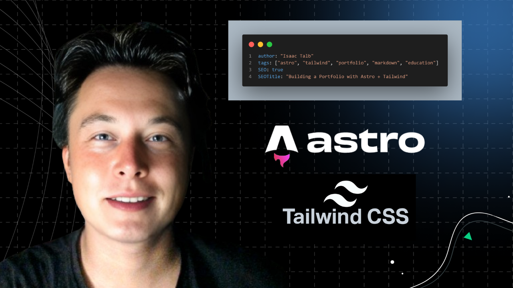

Markdown is one of the easiest ways to write content for blogs, portfolios, and documentation. If you are an absolute beginner, this guide will help you understand the most useful **Markdown syntax** so you can format posts that look clean, readable, and professional.

## Why Markdown Is So Useful

Markdown is popular because it is:

- **Simple** enough for beginners
- **Fast** to write and edit
- **Portable** across many tools and platforms
- **Perfect for developers** who want to keep content inside a code project

For my Astro portfolio, Markdown makes publishing blog posts much easier than writing raw HTML.

## Basic Markdown Syntax

Here are the formatting features you will use most often.

### Headings

Use heading symbols to organize your content:

```md
# Main Title
## Section Title
### Smaller Section
```

### Bold and Italic Text

```md
**Bold text**
*Italic text*
```

This helps emphasize important ideas without overcomplicating your writing.

### Lists

Unordered list:

```md
- First item
- Second item
- Third item
```

Ordered list:

```md
1. Step one
2. Step two
3. Step three
```

### Links

```md
[Visit my portfolio](https://isaac.duckcloud.info)
```

Links are useful for references, demos, and related resources.

### Images

```md

```

That is the standard Markdown format for adding images to a post.

## Practical Writing Tips for Better Blog Formatting

Good Markdown is not only about syntax. It is also about readability. Here are a few tips that make posts look better:

- Keep paragraphs short
- Use headings to break up long sections
- Use bullet lists for steps or takeaways
- Add images only when they support the content
- Avoid unnecessary HTML unless your layout really needs it

These small improvements make a huge difference in how professional your post feels.

## How I Use Markdown in This Portfolio

In this project, I use Markdown to:

- Write blog posts quickly
- Keep content easy to edit in Git
- Organize articles inside `src/content/blog`
- Maintain a clean workflow for publishing new posts

That means I can focus more on writing and less on formatting problems.

## Preview Image


## Who This Guide Is For

This guide is useful if you are:

- Starting your first blog
- Building an Astro website
- Writing developer notes or documentation
- Learning content formatting for the first time

## Final Thoughts

Markdown is a small skill that pays off quickly. Once you learn the basics, you can write cleaner blog posts, better documentation, and more organized content across almost any project.

If you are just getting started, practice the syntax above and keep your formatting simple. Clear writing always beats complicated styling.
