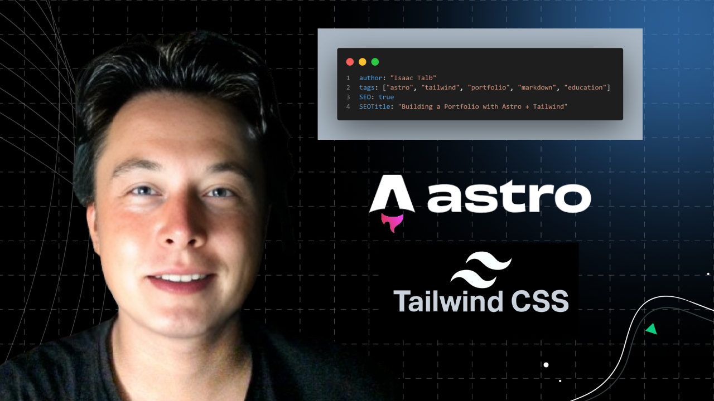

&nbsp;

<h1 class="text-3xl font-bold mb-8">My First Portfolio Blog</h1>

Hello everyone, I’m <strong class="text-blue-600">Isaac Talb</strong>. This is my very first blog post on my portfolio website, and I’d like to introduce how I built this project — so that <strong class="text-blue-600">newer developers</strong> can learn, copy, and apply it for their <strong class="text-blue-600">educational purposes</strong>.

&nbsp; 

## Project Stack
 
For this site, I combined three powerful tools:

- **Astro** → A modern static site builder, perfect for content-heavy sites.
- **Tailwind CSS** → A utility-first CSS framework that keeps styling fast and consistent.
- **Markdown** → Simple and developer-friendly for writing blog content.

This combination allows me (and you) to create a clean, fast, and easily maintainable portfolio website.

&nbsp;

## Project Implementation
 
Here’s a quick overview of how I set up this project:

1. **Created an Astro project** → `npm create astro@latest my-portfolio`
2. **Integrated Tailwind CSS** → followed Astro’s official Tailwind integration guide.
3. **Configured Markdown support** → blogs are written directly in `.md` files under `src/content/blog`.
4. **Used a layout component** → every blog post uses a shared layout (`MainLayout.astro`).
5. **Deployed to GitHub Pages** → free hosting for static sites.

With these steps, you can have a working personal portfolio and blogging system in no time.

&nbsp;

## Preview
 
Here’s a preview image of the project setup:

&nbsp;

&nbsp;

## Why Share This?
 
I built this not just for myself, but also to inspire <b>newer developers</b> who want to learn how to:

- Build a simple yet professional portfolio.
- Write content in Markdown.
- Deploy projects publicly for free.

You are welcome to **copy this project structure** and modify it for your own learning. Please note this is meant for **educational purposes only**.

&nbsp;

## Live Demo

Check out the live project here: <a class="text-blue-500 underline" href="https://dsfadf.com"> Portfolio Website Demo </a>

&nbsp;

## Closing

This is just the beginning.
In my **next blog post**, I’ll provide a more complete guide on **how to write Markdown content** so that anyone using this project can easily create their own posts.

For now, I hope this first post gives you a clear starting point. 🚀

