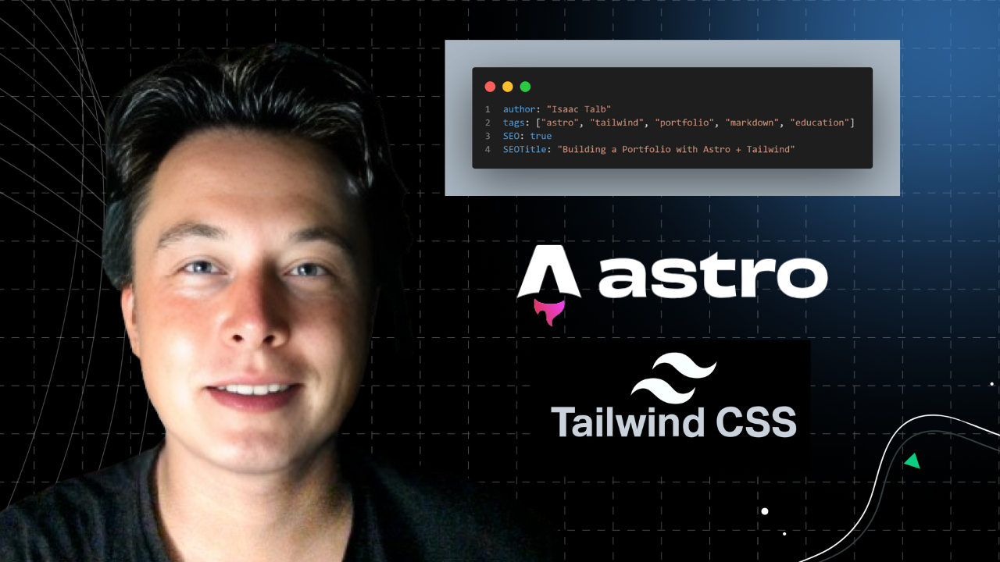

&nbsp;

# 🚀 Portfolio Project: Astro + Tailwind

 

**Author:** Isaac Talb  
**Type:** Educational Project  
**Live Demo:** [isaac.duckcloud.info](https://isaac.duckcloud.info)  

 
 

## 🔹 Overview 

&nbsp;

This project is a **personal portfolio website** designed with:  
- **Astro** → Static site builder for speed & simplicity  
- **Tailwind CSS** → Clean and consistent styling  
- **Markdown** → Easy content management  

The goal: **Build a fast, minimal, and professional portfolio site** that new developers can **learn from and replicate**.  

 
 

## 🔹 Key Features

 

- **Responsive design** with Tailwind utilities  
- **Markdown-driven blog** for effortless content updates  
- **Reusable Astro layouts** for consistent pages  
- **Free deployment** (GitHub Pages / Vercel)  

 
 

## 🔹 Educational Value  
 

This project demonstrates how to:  
1. Set up **Astro + Tailwind** quickly  
2. Structure content with **Markdown**  
3. Deploy to a free hosting service  

It’s a solid **starter project** for beginners in **frontend development**.  

 
 

  

 
 

## 🌍 Live Demo  

👉 Visit here: <a class="text-blue-500 underline" href="https://isaac.duckcloud.info"> Portfolio Website Demo </a> 

